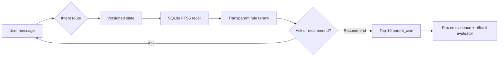
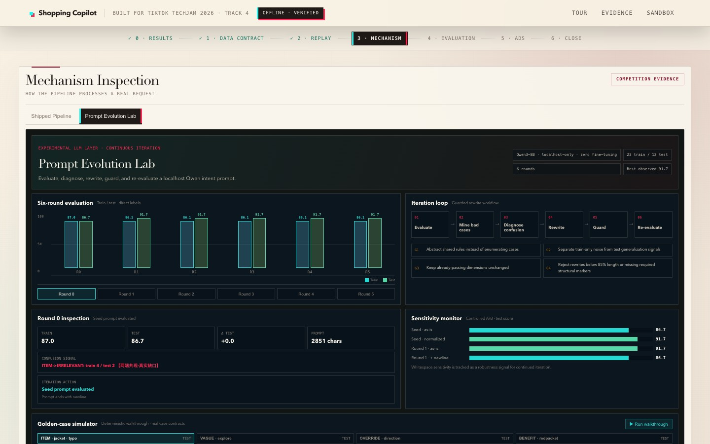
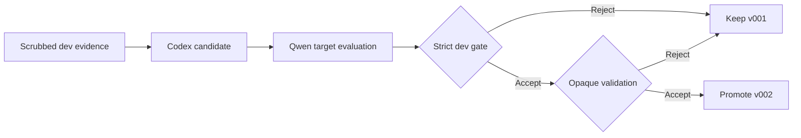
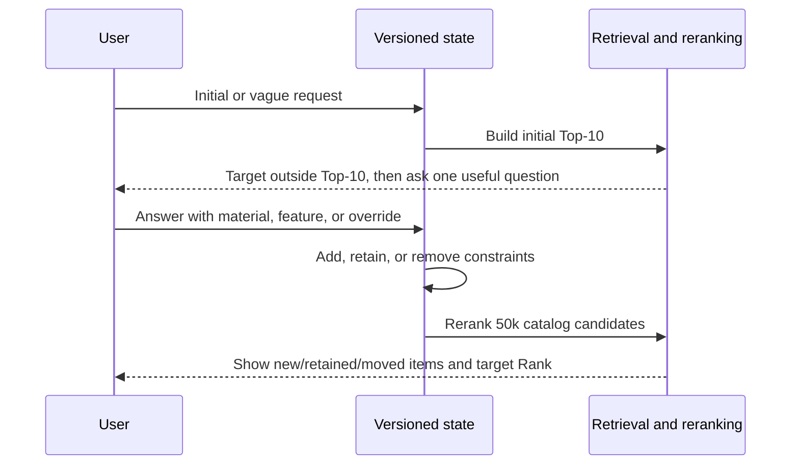
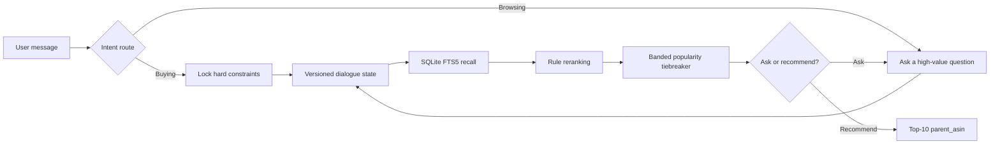
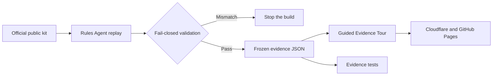

# Conversational Shopping Copilot — TechJam 2026 Track 4

[English](README.md) | [简体中文](README.zh-CN.md)

An offline, CPU-only, multi-turn shopping agent over the frozen 50,000-product
Amazon Reviews 2023 `Clothing_Shoes_and_Jewelry` catalog.

> **Try the judge-facing evidence tour:**
> [shopping-copilot-techjam.pages.dev](https://shopping-copilot-techjam.pages.dev/)
> · [中文界面](https://shopping-copilot-techjam.pages.dev/?lang=zh)

The scored path uses the Python standard library, SQLite FTS5, and deterministic
rules. It needs no network, API key, paid model, or GPU.

<p align="center">
  <a href="https://shopping-copilot-techjam.pages.dev/">
    
  </a>
</p>

## Start here

| If you are… | Start with | What you will get |
| --- | --- | --- |
| A judge | [3-minute Evidence Tour](https://shopping-copilot-techjam.pages.dev/) | Results → data contract → replay → mechanism → evaluation → ads → boundaries |
| Reviewing the product story | [YouTube demo film](https://youtu.be/iRec-9CM9D4) | A public, bilingual, three-minute walkthrough |
| Reproducing the score | [Quick start](#quick-start) | The exact rules-only evaluator command and expected metrics |
| Inspecting implementation | [How every stage works](#how-every-stage-works) | Inputs, decisions, outputs, evidence, and source files for each stage |
| Working with scripts | [Script guide](scripts/README.md) | Supported release commands separated from research diagnostics |
| Auditing claims | [Claim and data boundaries](#claim-and-data-boundaries) | Public evidence, synthetic experiments, held-out, and private-set limits |

## Three separate execution paths

| Path | Entry point | Purpose | Part of the official score? |
| --- | --- | --- | --- |
| **Submitted Agent** | `submission/agent.py` | Rules, state, FTS5 recall, reranking, Top-10 output | **Yes** |
| **Judge Evidence Tour** | `demo/static/` + `demo/evidence/` | Deterministic replay of frozen official-public traces | No |
| **Optional development layers** | `/sandbox`, Scheme B Qwen, cross-encoder, ad auction | Product experiments and technical transparency | No |

The boundaries are physical, not just copy: the official evaluator never calls
the website, the ad auction, the video, or the optional Qwen layer.

## 3-minute V3 demo film

[](https://youtu.be/iRec-9CM9D4)

**[Watch the public 3-minute demo on YouTube — English voice · English / 中文字幕 · original score](https://youtu.be/iRec-9CM9D4)**

[English subtitles](docs/assets/video/shopping-copilot-demo-v3.en.srt) ·
[中文字幕](docs/assets/video/shopping-copilot-demo-v3.zh-CN.srt) ·
[Repository MP4 backup](docs/assets/video/shopping-copilot-demo-v3.mp4) ·
[Live evidence tour](https://shopping-copilot-techjam.pages.dev/)

## Verified public-set result

Measured with the unmodified official evaluator on the 200 labeled public
development sessions:

| System | HitRate@10 | MRR | MTTC | Efficiency | TechnicalScore |
| --- | ---: | ---: | ---: | ---: | ---: |
| Official weak BM25 starter | 0.125 | 0.068034 | 9.810 | 0.1190 | 0.10671 |
| **Rules V1.3, submitted path** | **0.995** | **0.644355** | **2.215** | **0.8785** | **0.866507** |

That is about **8.1× the starter TechnicalScore**. These are public-set results,
not evidence about the organizer's 800 private sessions.

## How every stage works

| Stage | Input | What happens | Output / evidence | Main implementation |
| --- | --- | --- | --- | --- |
| **1. Contract** | Official catalog, session profile, user message, turn, `top_k` | Validate the evaluator contract and keep the catalog read-only | Contract-safe response fields; zero token usage on rules path | `submission/agent.py`, `shopping_copilot/official_agent.py` |
| **2. Intent routing** | Latest message + pending question | Classify Buying vs Browsing and dialogue act; Scheme B v002 is optional and localhost-only | `domain_intent`, `dialogue_act`, confidence, normalized clauses | `RuleIntentParser`, optional `prompts/system_prompt_v002.md` |
| **3. Versioned state** | Parsed clauses + previous state | Add, retain, negate, reject, or erase-and-rewrite superseded preferences | Inspectable hard/soft/negative state diff | `ShoppingState.apply` in `shopping_copilot/shopping_agent.py` |
| **4. Recall** | Category, constraints, retrieval evidence, safe profile tags | SQLite FTS5 builds a broad lexical candidate pool and removes rejected/negative matches | Up to 50 policy candidates; public target recall 200/200 | `CatalogSearch.search` |
| **5. Reranking** | Recalled candidates + state | Reward exact category/constraint matches, penalize hard misses, then use popularity only inside near-tie bands | Deterministic ordered Top-10 `parent_asin` list | Rule scorer + banded tiebreaker |
| **6. Ask or recommend** | Current policy candidate pool | Coverage × entropy chooses one useful attribute only when information gain is high enough | `ask_attribute` or a focused recommendation response | `CandidateQuestionPolicy.choose` |
| **7. Evidence delivery** | Frozen official-public run artifacts | Validate IDs, metrics, hashes, case freeze, and organic-order invariants | 200 trace JSON files, bilingual Tour, report, video, reproducible static bundle | `scripts/build_demo_evidence.py`, `scripts/build_static_site.py` |



## See it in action

| Competition data contract | Intent Override replay |
| --- | --- |
| [](https://shopping-copilot-techjam.pages.dev/?step=1) | [](https://shopping-copilot-techjam.pages.dev/?step=2) |
| **Verified evaluation** | **Transparent demo-only ads** |
| [](https://shopping-copilot-techjam.pages.dev/?step=4) | [](https://shopping-copilot-techjam.pages.dev/?step=5) |

### Trace Microscope: inspect the shipped mechanism

[](https://shopping-copilot-techjam.pages.dev/?step=3)

The five interactive stages use different trace-backed visuals: a route fork,
state transition, recall funnel, Top-3 podium, and question-decision chain. The
score anatomy exposes every shipped ranking weight and keeps popularity as a
near-tie signal only.

### Prompt Evolution Lab: inspect accepted Scheme B evolution

[](https://shopping-copilot-techjam.pages.dev/?step=3)

Switch Step 3 to **Prompt Evolution Lab** to inspect the accepted Scheme B
experiment from [`codex/scheme-b-prompt-evolution`](https://github.com/Starryyu77/techjam-shopping-agent-v1/tree/codex/scheme-b-prompt-evolution).
A Codex-authored candidate was evaluated by a zero-fine-tuning Qwen3-8B target
on 18 synthetic dev sessions / 90 annotated turns. Composite improved from
**0.6137 to 0.7191** (+0.1053 absolute, +17.2% relative). Slot F1 improved from
0.2727 to 0.5652 and rollout-state exactness from 0.1000 to 0.2222; every other
non-saturated protected metric improved, while JSON compliance remained 1.0.

The candidate passed one opaque validation gate over 6 sessions / 30 turns.
Validation exposed only accept/reject and then terminated the run; held-out
labels remain unbundled and were not run. Nine clickable examples show the
v001/v002 contract differences, followed by an artifact-backed promotion
walkthrough. They are not presented as live model responses.



We independently recomputed the saved metric formulas, confusion-derived
accuracies, prompt hashes, and non-regression gate. The original localhost Qwen
service was not running on the verification host, so this is explicitly
artifact-recomputed verification rather than a claimed model-inference rerun.
The official competition score remains tied to the deterministic submitted path.

## Multi-turn recommendation and ranking evidence

The Tour exposes nine owner-frozen official-public traces across Buying,
Browsing, and Intent Override. Each case shows the user answer, state update,
Top-10 list delta, per-item movement, and target-rank progression.

| Scenario | Public case | Dialogue and recommendation impact | Outcome |
| --- | --- | --- | --- |
| Buying | `public_0018` | Target outside Top-10 for two turns; material answer replaces 8/10 results | **Rank #1** on Turn 3 |
| Buying | `public_0152` | Detailed color and material bundle introduces the target watch | **Rank #1** on Turn 3 |
| Buying | `public_0179` | Three rounds of refinement before the closure answer changes the list | **Rank #2** on Turn 4 |
| Browsing | `public_0049` | Six-turn exploration: leather → brown → rubber → casual → soft | 9 new results; **Rank #1** on Turn 6 |
| Browsing | `public_0007` | Vague request becomes polyester + spandex | **Rank #1** on Turn 3 |
| Browsing | `public_0063` | One stretch-feature clarification resolves a vague request | **Rank #1** on Turn 2 |
| Intent Override | `public_0003` | Remove stainless steel, continue refining, then rerank | 9 new results; **Rank #1** on Turn 5 |
| Intent Override | `public_0046` | Public preview moves #5 → #1; override removes cotton/polyester and retains wool | Scored **Rank #1** on Turn 4 |
| Intent Override | `public_0142` | Remove three old values; add stainless steel and hypoallergenic | Scored **Rank #1** on Turn 4 |

| Buying: answer changes 8/10 results | Browsing: six turns to Rank #1 | Override: reset and recover |
| --- | --- | --- |
| [](https://shopping-copilot-techjam.pages.dev/?step=2) | [](https://shopping-copilot-techjam.pages.dev/?step=2) | [](https://shopping-copilot-techjam.pages.dev/?step=2) |

| Preview #5 → #1 → scored #1 (`public_0046`) | Multi-slot rewrite (`public_0142`) |
| --- | --- |
| [](https://shopping-copilot-techjam.pages.dev/?step=2) | [](https://shopping-copilot-techjam.pages.dev/?step=2) |

The Replay distinguishes a public-label preview from an official scored hit.
Before the override gate is satisfied, a visible target is labelled `Public
preview`, never `Scored target`.



## What the project demonstrates

- **Buying vs. Browsing routing:** concrete requests lock constraints; vague
  requests trigger targeted clarification.
- **Explicit dialogue state:** hard, soft, negative, rejected-item, and raw
  retrieval evidence remain inspectable across turns.
- **Intent Override:** superseded preferences are erased and rewritten instead
  of appended.
- **Lightweight retrieval and ranking:** SQLite FTS5 recall, transparent rule
  reranking, and a banded popularity tiebreaker.
- **Candidate-driven questions:** coverage × entropy selects the most useful
  next attribute.
- **Evidence-first delivery:** the public website replays frozen official-public
  traces and never depends on a live LLM.
- **Prompt self-evolution:** Scheme B separates a Codex optimizer, Qwen target,
  strict dev gate, opaque validation, and untouched held-out labels.
- **Demo-only commercial extension:** a clearly separated relevance-aware ad
  auction illustrates monetization without altering organic ordering.

## Quick start

### 1. Clone

```bash
git clone https://github.com/Starryyu77/techjam-shopping-agent-v1.git
cd techjam-shopping-agent-v1
```

Python 3.11+ is recommended.

### 2. Run the official public evaluator

Place the official participant kit next to this repository, or pass its path
explicitly:

```bash
python tools/evaluate_official.py \
  --official-root ../techjam-conversational-search \
  --intent-backend rules \
  --output reports/official_public_rules.json
```

### 3. Run locally

```bash
# Judge-facing tour at /; optional legacy chat sandbox at /sandbox
python demo/server.py --port 8000

# Interactive CLI, fully offline
python tools/chat.py --intent-backend rules
```

Open `http://127.0.0.1:8000`.

### 4. Verify

```bash
python -m unittest discover -s tests -v
```

Current expected result: **99 tests pass**.

## Evidence reproduction

The repository ships 200 frozen public-session traces so the Tour works in a
clean checkout. Rebuild them only when the Agent or evidence contract changes:

```bash
python scripts/build_demo_evidence.py \
  --official-root ../techjam-conversational-search
```

The builder fails closed on metric drift, invalid or duplicate ASINs, trace/report
mismatches, missing hashes, non-public cases, or an unfrozen canonical-case set.

## Script guide

Use [`scripts/README.md`](scripts/README.md) as the canonical script index. It
separates stable delivery commands from diagnostic snapshots and records runtime
or dependency expectations for every top-level script.

| Task | Command |
| --- | --- |
| Evaluate the development repository | `python tools/evaluate_official.py --official-root ../techjam-conversational-search --intent-backend rules --output reports/official_public_rules.json` |
| Evaluate the exact `submission/` package | `python scripts/run_submission_eval.py --official-root ../techjam-conversational-search --output reports/submission_public_rules.json` |
| Rebuild all website evidence | `python scripts/build_demo_evidence.py --official-root ../techjam-conversational-search` |
| Build the static deployment bundle | `python scripts/build_static_site.py` |
| Run repository contracts | `python -m unittest discover -s tests -v` |
| Inspect a command | `python <entrypoint> --help` |

The remaining `scripts/` files are ranked as recall/ranking diagnostics,
parameter sweeps, synthetic stress tests, or Windows Qwen utilities. They remain
in place for provenance, but are not presented as the normal release path.

## Architecture



The official evaluator calls `submission/agent.py`. Demo narration, ad placement,
and the legacy chat UI live outside that scored path.

### Evidence delivery pipeline



## Repository map

| Path | Purpose |
| --- | --- |
| `submission/agent.py` | Required official `Agent` interface |
| `shopping_copilot/` | Reusable Python package: state, retrieval, ranking, official adapter, optional reranker |
| `tools/` | User-facing CLIs for evaluation, chat, and prompt experiments |
| `docs/` | Product, technical, project, submission, prompt, and design documentation |
| `shopping_copilot/shopping_agent.py` | Intent, state machine, retrieval, ranking, question policy |
| `tools/evaluate_official.py` | Adapter for the unmodified official evaluator |
| `demo/static/tour.*` | Judge-facing Guided Evidence Tour |
| `demo/evidence/` | Shipped public evidence artifacts and 200 traces |
| `demo/canonical_cases.json` | Source-controlled canonical-case freeze |
| `scripts/build_demo_evidence.py` | Evidence regeneration and validation |
| `scripts/build_static_site.py` | Portable static deployment bundle |
| `scripts/README.md` | Canonical script catalog, supported workflows, dependencies, and boundaries |
| `reports/` | Reproducible experiment and evaluator outputs |
| `reports/scheme_b_prompt_evolution_verified.json` | Recomputed Scheme B metrics, gates, hashes, and claim boundary |
| `shopping_copilot/reranker.py` | Optional cross-encoder experiment, OFF by default |

## Claim and data boundaries

- The catalog and official datasets are read-only.
- Only official public labels appear in the shipped replay evidence.
- The organizer-private 800-session performance remains unknown.
- The public score is not called a hidden-set, private-set, or final score.
- Optional Qwen and cross-encoder layers are experiments, not dependencies of
  the submitted rules path.
- The ad auction uses simulated bids and budgets and is never called by the
  official evaluator.

## Documentation

| Document | Audience |
| --- | --- |
| [Documentation index](docs/README.md) | Map of product, technical, submission, prompt, and design documents |
| [Technical report](docs/technical/REPORT.md) | Architecture, experiments, results, limitations |
| [Product brief, Chinese](docs/product/PRODUCT.md) | Product and demo boundaries |
| [Devpost draft](docs/submission/DEVPOST.md) | Submission narrative |
| [Judge Tour design](docs/plans/2026-08-30-judge-facing-demo-design.md) | Design and handoff specification |
| [Demo walkthrough](demo/WALKTHROUGH.md) | Tour operation and evidence stations |
| [Video script](demo/VIDEO_SCRIPT.md) | Three-minute recording plan |
| [Submission package](submission/README.md) | Minimal evaluator-facing package |
| [Script guide](scripts/README.md) | Supported release commands, diagnostics, dependencies, and operational boundaries |
| [Development plan](docs/project/PLANS.md) | Completed milestones and intentionally deferred work |
| [Prompt iteration loop](docs/prompt/loop.md) | Leakage-safe prompt acceptance process |
| [Engineering lessons](docs/prompt/loop-lessons.md) | Failure patterns and fixes |
| [Current intent prompt v002](prompts/system_prompt_v002.md) | Scheme B prompt accepted by dev and one opaque validation gate |

## Deployment and links

- **Live Tour:** https://shopping-copilot-techjam.pages.dev/
- **GitHub Pages fallback:** https://starryyu77.github.io/techjam-shopping-agent-v1/
- **Source repository:** https://github.com/Starryyu77/techjam-shopping-agent-v1
- **Public YouTube demo:** https://youtu.be/iRec-9CM9D4

## License and upstream data

Follow the official participant kit's data and submission terms. This repository
does not redistribute the full upstream Amazon Reviews 2023 dataset; the Tour
contains only the competition's labeled public-session evidence required for
reproducible demonstration.
