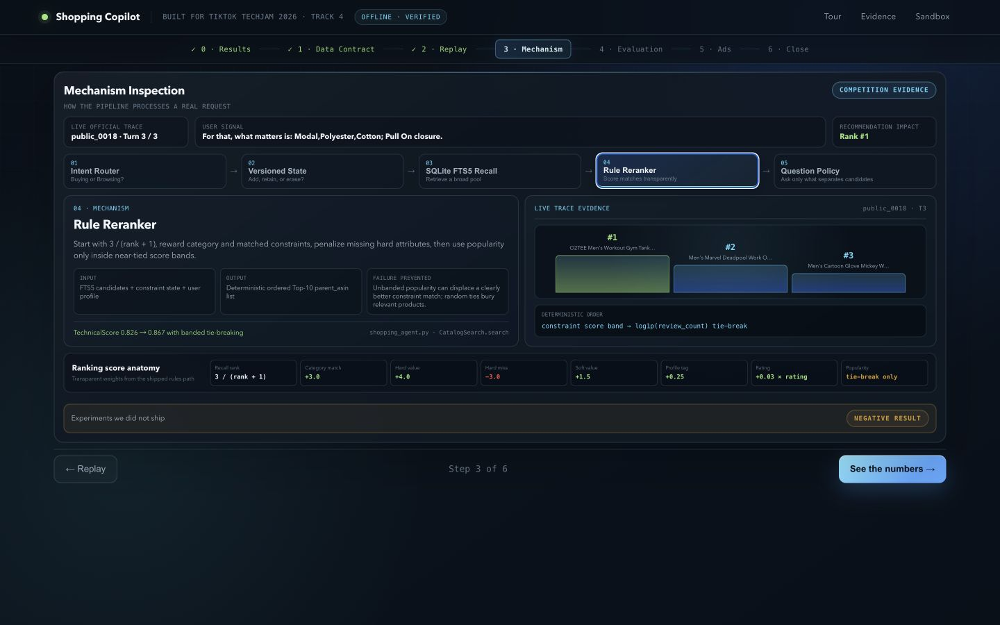
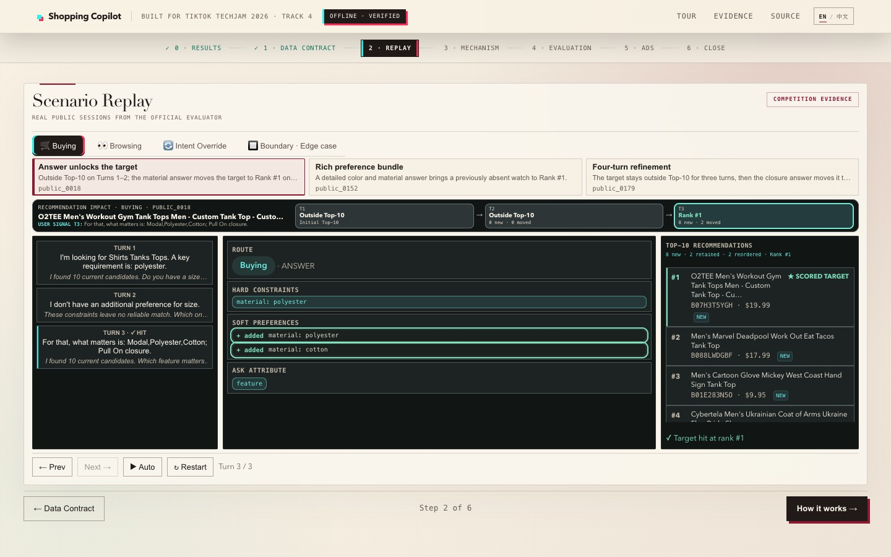
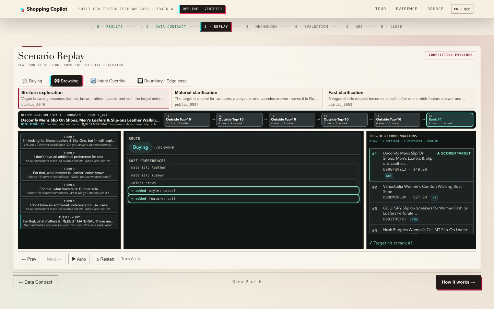
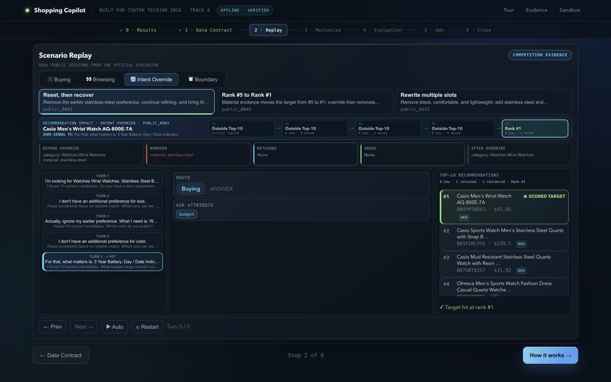
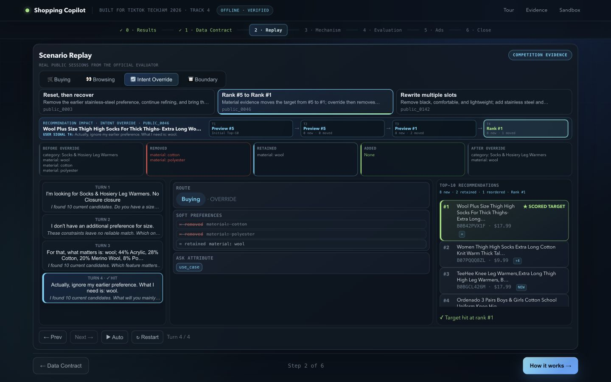
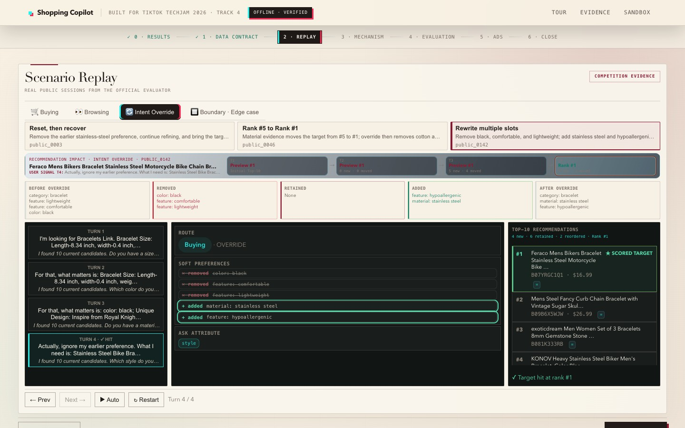
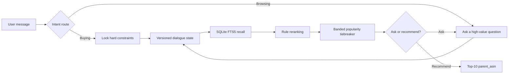
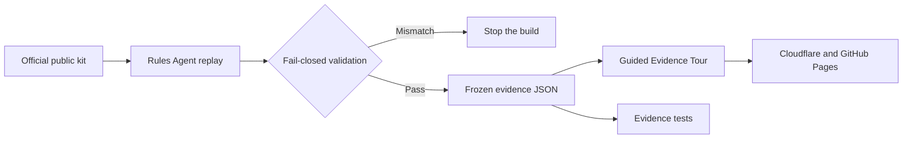

# Conversational Shopping Copilot — TechJam 2026 Track 4

[English](README.md) | [简体中文](README.zh-CN.md)

An offline, CPU-only, multi-turn shopping agent over the frozen 50,000-product
Amazon Reviews 2023 `Clothing_Shoes_and_Jewelry` catalog.

> **Try the judge-facing evidence tour:**
> [shopping-copilot-techjam.pages.dev](https://shopping-copilot-techjam.pages.dev/)

The scored path uses the Python standard library, SQLite FTS5, and deterministic
rules. It needs no network, API key, paid model, or GPU.

<p align="center">
  <a href="https://shopping-copilot-techjam.pages.dev/">
    
  </a>
</p>

## Verified public-set result

Measured with the unmodified official evaluator on the 200 labeled public
development sessions:

| System | HitRate@10 | MRR | MTTC | Efficiency | TechnicalScore |
| --- | ---: | ---: | ---: | ---: | ---: |
| Official weak BM25 starter | 0.125 | 0.068034 | 9.810 | 0.1190 | 0.10671 |
| **Rules V1.3, submitted path** | **0.995** | **0.644355** | **2.215** | **0.8785** | **0.866507** |

That is about **8.1× the starter TechnicalScore**. These are public-set results,
not evidence about the organizer's 800 private sessions.

## See it in action

| Competition data contract | Intent Override replay |
| --- | --- |
| [](https://shopping-copilot-techjam.pages.dev/?step=1) | [](https://shopping-copilot-techjam.pages.dev/?step=2) |
| **Verified evaluation** | **Transparent demo-only ads** |
| [](https://shopping-copilot-techjam.pages.dev/?step=4) | [](https://shopping-copilot-techjam.pages.dev/?step=5) |

### Trace Microscope: inspect the shipped mechanism

[](https://shopping-copilot-techjam.pages.dev/?step=3)

The five interactive stages use different trace-backed visuals: a route fork,
state transition, recall funnel, Top-3 podium, and question-decision chain. The
score anatomy exposes every shipped ranking weight and keeps popularity as a
near-tie signal only.

## Multi-turn recommendation and ranking evidence

The Tour exposes nine owner-frozen official-public traces across Buying,
Browsing, and Intent Override. Each case shows the user answer, state update,
Top-10 list delta, per-item movement, and target-rank progression.

| Scenario | Public case | Dialogue and recommendation impact | Outcome |
| --- | --- | --- | --- |
| Buying | `public_0018` | Target outside Top-10 for two turns; material answer replaces 8/10 results | **Rank #1** on Turn 3 |
| Buying | `public_0152` | Detailed color and material bundle introduces the target watch | **Rank #1** on Turn 3 |
| Buying | `public_0179` | Three rounds of refinement before the closure answer changes the list | **Rank #2** on Turn 4 |
| Browsing | `public_0049` | Six-turn exploration: leather → brown → rubber → casual → soft | 9 new results; **Rank #1** on Turn 6 |
| Browsing | `public_0007` | Vague request becomes polyester + spandex | **Rank #1** on Turn 3 |
| Browsing | `public_0063` | One stretch-feature clarification resolves a vague request | **Rank #1** on Turn 2 |
| Intent Override | `public_0003` | Remove stainless steel, continue refining, then rerank | 9 new results; **Rank #1** on Turn 5 |
| Intent Override | `public_0046` | Public preview moves #5 → #1; override removes cotton/polyester and retains wool | Scored **Rank #1** on Turn 4 |
| Intent Override | `public_0142` | Remove three old values; add stainless steel and hypoallergenic | Scored **Rank #1** on Turn 4 |

| Buying: answer changes 8/10 results | Browsing: six turns to Rank #1 | Override: reset and recover |
| --- | --- | --- |
| [](https://shopping-copilot-techjam.pages.dev/?step=2) | [](https://shopping-copilot-techjam.pages.dev/?step=2) | [](https://shopping-copilot-techjam.pages.dev/?step=2) |

| Preview #5 → #1 → scored #1 (`public_0046`) | Multi-slot rewrite (`public_0142`) |
| --- | --- |
| [](https://shopping-copilot-techjam.pages.dev/?step=2) | [](https://shopping-copilot-techjam.pages.dev/?step=2) |

The Replay distinguishes a public-label preview from an official scored hit.
Before the override gate is satisfied, a visible target is labelled `Public
preview`, never `Scored target`.

```mermaid
sequenceDiagram
    participant U as User
    participant S as Versioned state
    participant R as Retrieval and reranking
    U->>S: Initial or vague request
    S->>R: Build initial Top-10
    R-->>U: Target outside Top-10; ask one useful question
    U->>S: Answer with material, feature, or override
    S->>S: Add, retain, or remove constraints
    S->>R: Rerank 50k catalog candidates
    R-->>U: Show new/retained/moved items and target Rank #1
```

## What the project demonstrates

- **Buying vs. Browsing routing:** concrete requests lock constraints; vague
  requests trigger targeted clarification.
- **Explicit dialogue state:** hard, soft, negative, rejected-item, and raw
  retrieval evidence remain inspectable across turns.
- **Intent Override:** superseded preferences are erased and rewritten instead
  of appended.
- **Lightweight retrieval and ranking:** SQLite FTS5 recall, transparent rule
  reranking, and a banded popularity tiebreaker.
- **Candidate-driven questions:** coverage × entropy selects the most useful
  next attribute.
- **Evidence-first delivery:** the public website replays frozen official-public
  traces and never depends on a live LLM.
- **Demo-only commercial extension:** a clearly separated relevance-aware ad
  auction illustrates monetization without altering organic ordering.

## Quick start

### 1. Clone

```bash
git clone https://github.com/Starryyu77/techjam-shopping-agent-v1.git
cd techjam-shopping-agent-v1
```

Python 3.11+ is recommended.

### 2. Run the official public evaluator

Place the official participant kit next to this repository, or pass its path
explicitly:

```bash
python evaluate_official.py \
  --official-root ../techjam-conversational-search \
  --intent-backend rules \
  --output reports/official_public_rules.json
```

### 3. Run locally

```bash
# Judge-facing tour at /; optional legacy chat sandbox at /sandbox
python demo/server.py --port 8000

# Interactive CLI, fully offline
python chat.py --intent-backend rules
```

Open `http://127.0.0.1:8000`.

### 4. Verify

```bash
python -m unittest discover -s tests -v
```

Current expected result: **100 tests pass** when the optional catalog fixture is present.

## Optional Scheme B prompt evolution

`prompt_lab.py` is the only supported entry point for prompt evaluation and
automatic iteration. `exp_selfevolve/` is retained only as a historical
experiment and must not be used for acceptance or submission evidence.
The repository bundles the synthetic Gold-candidate dev and validation splits
under `prompt_data/`; held-out labels are deliberately excluded.

The recommended workflow has Codex author a candidate from scrubbed dev bad
cases while Qwen acts only as the target. The candidate is a complete system
prompt file:

```bash
python prompt_lab.py optimize \
  --backend model \
  --target-endpoint http://127.0.0.1:8080/v1 \
  --target-model qwen3-8b \
  --candidate-prompt prompts/candidates/codex_round_001.md \
  --rounds 1
```

A fully automatic experiment may use a model optimizer, but its endpoint must
be supplied explicitly and remain separate:

```bash
python prompt_lab.py optimize \
  --backend model \
  --target-endpoint http://127.0.0.1:8080/v1 \
  --target-model qwen3-8b \
  --optimizer-endpoint http://127.0.0.1:8081/v1 \
  --optimizer-model qwen3-8b \
  --judge-endpoint http://127.0.0.1:8082/v1 \
  --judge-model qwen3-8b \
  --rounds 3
```

`--endpoint` falls back only to the target and can no longer create an optimizer
implicitly. The optimizer must use a different normalized endpoint from target
and judge; changing only the model alias cannot bypass this boundary.
A candidate must improve dev score without any protected-metric regression
before validation is read once. Validation exposes only opaque accept/reject,
then terminates the run on either result; raw messages, bad cases, confusions,
per-metric deltas, and judge reasons are not persisted. Dev evidence, prompt
diffs, and decisions remain under `reports/prompt_evolution/`.

The first clean-room Codex candidate improved dev composite from **0.6137 to
0.7191** and passed the single opaque validation gate, promoting the current
pointer to `system_prompt_v002.md`. This is an intent-parser gain on the
self-labelled Gold-candidate set, not a claim of a changed official retrieval score.

The held-out test has **not** been run. Its labels are not bundled. Supply the
full external dataset only after the prompt and evaluation code are frozen;
the command records a one-time freeze manifest and refuses a second run:

```bash
SYSTEM_SHA256=$(python prompt_lab.py fingerprint --backend model)
python prompt_lab.py evaluate \
  --backend model \
  --endpoint http://127.0.0.1:8080/v1 \
  --dataset /path/to/full-gold-dataset \
  --split test \
  --confirm-heldout FINAL-FROZEN \
  --frozen-system-sha256 "$SYSTEM_SHA256"
```

## Evidence reproduction

The repository ships 200 frozen public-session traces so the Tour works in a
clean checkout. Rebuild them only when the Agent or evidence contract changes:

```bash
python scripts/build_demo_evidence.py \
  --official-root ../techjam-conversational-search
```

The builder fails closed on metric drift, invalid or duplicate ASINs, trace/report
mismatches, missing hashes, non-public cases, or an unfrozen canonical-case set.

## Architecture



The official evaluator calls `submission/agent.py`. Demo narration, ad placement,
and the legacy chat UI live outside that scored path.

### Evidence delivery pipeline



## Repository map

| Path | Purpose |
| --- | --- |
| `submission/agent.py` | Required official `Agent` interface |
| `shopping_agent.py` | Intent, state machine, retrieval, ranking, question policy |
| `evaluate_official.py` | Adapter for the unmodified official evaluator |
| `demo/static/tour.*` | Judge-facing Guided Evidence Tour |
| `demo/evidence/` | Shipped public evidence artifacts and 200 traces |
| `demo/canonical_cases.json` | Source-controlled canonical-case freeze |
| `scripts/build_demo_evidence.py` | Evidence regeneration and validation |
| `scripts/build_static_site.py` | Portable static deployment bundle |
| `reports/` | Reproducible experiment and evaluator outputs |
| `reranker.py` | Optional cross-encoder experiment, OFF by default |

## Claim and data boundaries

- The catalog and official datasets are read-only.
- Only official public labels appear in the shipped replay evidence.
- The organizer-private 800-session performance remains unknown.
- The public score is not called a hidden-set, private-set, or final score.
- Optional Qwen and cross-encoder layers are experiments, not dependencies of
  the submitted rules path.
- The ad auction uses simulated bids and budgets and is never called by the
  official evaluator.

## Documentation

| Document | Audience |
| --- | --- |
| [Technical report](REPORT.md) | Architecture, experiments, results, limitations |
| [Product brief, Chinese](PRODUCT.md) | Product and demo boundaries |
| [Devpost draft](DEVPOST.md) | Submission narrative |
| [Judge Tour design](docs/plans/2026-08-30-judge-facing-demo-design.md) | Design and handoff specification |
| [Demo walkthrough](demo/WALKTHROUGH.md) | Tour operation and evidence stations |
| [Video script](demo/VIDEO_SCRIPT.md) | Three-minute recording plan |
| [Submission package](submission/README.md) | Minimal evaluator-facing package |
| [Development plan](PLANS.md) | Completed milestones and intentionally deferred work |
| [Prompt iteration loop](docs/loop.md) | Leakage-safe prompt acceptance process |
| [Engineering lessons](docs/loop-lessons.md) | Failure patterns and fixes |
| [Current intent prompt v002](prompts/system_prompt_v002.md) | Local-model parser contract accepted by dev and one opaque validation run |

## Deployment and links

- **Live Tour:** https://shopping-copilot-techjam.pages.dev/
- **GitHub Pages fallback:** https://starryyu77.github.io/techjam-shopping-agent-v1/
- **Source repository:** https://github.com/Starryyu77/techjam-shopping-agent-v1
- **Demo video:** pending final recording and public YouTube upload

## License and upstream data

Follow the official participant kit's data and submission terms. This repository
does not redistribute the full upstream Amazon Reviews 2023 dataset; the Tour
contains only the competition's labeled public-session evidence required for
reproducible demonstration.
