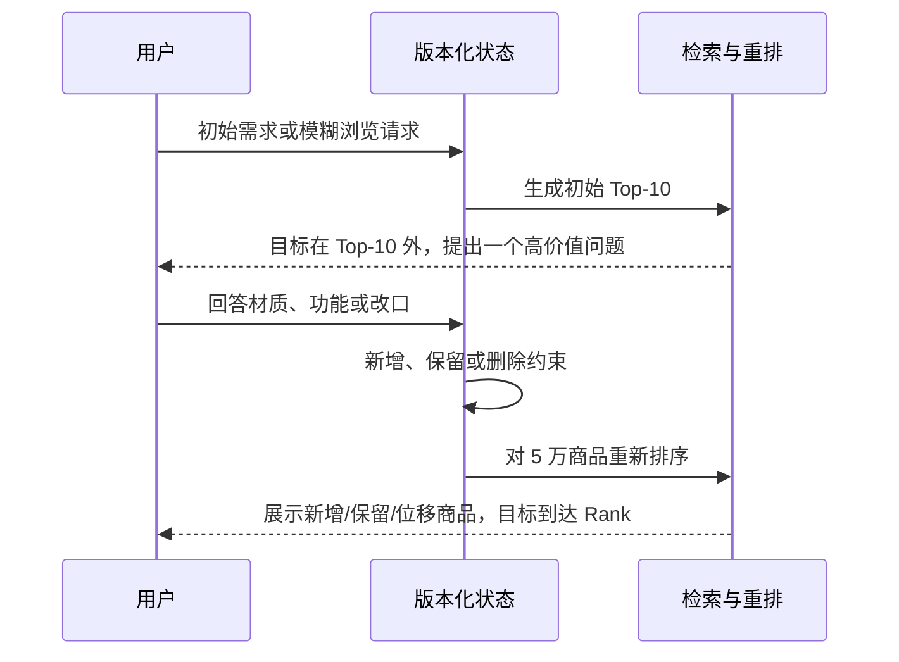
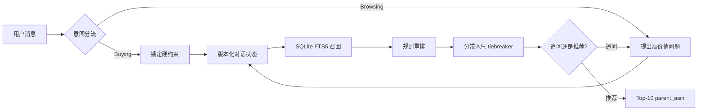
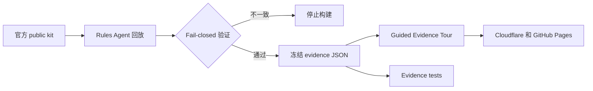

# 对话式购物 Copilot — TechJam 2026 赛题四

[English](README.md) | [简体中文](README.zh-CN.md)

一个运行在冻结的 Amazon Reviews 2023 `Clothing_Shoes_and_Jewelry` 5 万商品目录上的离线、多轮购物 Agent。

> **在线体验评委证据导览：**
> [shopping-copilot-techjam.pages.dev](https://shopping-copilot-techjam.pages.dev/)

正式打分路径只使用 Python 标准库、SQLite FTS5 和确定性规则，不需要网络、API Key、付费模型或 GPU。

<p align="center">
  <a href="https://shopping-copilot-techjam.pages.dev/">
    
  </a>
</p>

## 已验证的公开集结果

以下结果来自未修改的官方评测器和 200 个带标签的 public development sessions：

| 系统 | HitRate@10 | MRR | MTTC | Efficiency | TechnicalScore |
| --- | ---: | ---: | ---: | ---: | ---: |
| 官方弱 BM25 starter | 0.125 | 0.068034 | 9.810 | 0.1190 | 0.10671 |
| **Rules V1.3，提交路径** | **0.995** | **0.644355** | **2.215** | **0.8785** | **0.866507** |

TechnicalScore 约为 starter 的 **8.1 倍**。这些只是公开集结果，不能代表主办方保留的 800 个 private sessions。

## 实际页面

| 比赛数据合同 | Intent Override 回放 |
| --- | --- |
| [](https://shopping-copilot-techjam.pages.dev/?step=1) | [](https://shopping-copilot-techjam.pages.dev/?step=2) |
| **已验证评测结果** | **透明的 Demo-only 广告** |
| [](https://shopping-copilot-techjam.pages.dev/?step=4) | [](https://shopping-copilot-techjam.pages.dev/?step=5) |

### Trace Microscope：检查真实机制

[](https://shopping-copilot-techjam.pages.dev/?step=3)

五个可点击阶段分别使用路由分叉图、状态迁移图、召回漏斗、Top-3 排名台和追问
决策链，并全部读取 Replay 当前轮次。Score anatomy 会公开正式路径中的全部排序
权重，并明确 popularity 只参与近似分数的 tie-break。

## 多轮推荐与排序证据

Tour 现在展示 9 个由 owner 冻结的官方 public traces，覆盖 Buying、Browsing
和 Intent Override。每个案例都能看到用户回答、状态变化、Top-10 新增/保留/重排、
单个商品位次变化和目标商品排名轨迹。

| 场景 | Public case | 对话与推荐变化 | 结果 |
| --- | --- | --- | --- |
| Buying | `public_0018` | 目标连续两轮不在 Top-10；材质回答替换 8/10 个结果 | Turn 3 **Rank #1** |
| Buying | `public_0152` | 颜色与材质组合回答让目标手表首次进入列表 | Turn 3 **Rank #1** |
| Buying | `public_0179` | 连续三轮细化，closure 回答再次改变列表 | Turn 4 **Rank #2** |
| Browsing | `public_0049` | 六轮探索：leather → brown → rubber → casual → soft | 换入 9 个结果；Turn 6 **Rank #1** |
| Browsing | `public_0007` | 模糊需求被澄清为 polyester + spandex | Turn 3 **Rank #1** |
| Browsing | `public_0063` | 一个 stretch-feature 回答完成模糊需求澄清 | Turn 2 **Rank #1** |
| Intent Override | `public_0003` | 删除 stainless steel，继续回答，再次重排 | 换入 9 个结果；Turn 5 **Rank #1** |
| Intent Override | `public_0046` | Public preview 从 #5 到 #1；Override 删除 cotton/polyester、保留 wool | Turn 4 计分 **Rank #1** |
| Intent Override | `public_0142` | 删除三个旧值，新增 stainless steel 与 hypoallergenic | Turn 4 计分 **Rank #1** |

| Buying：回答替换 8/10 个结果 | Browsing：六轮到 Rank #1 | Override：清空旧偏好后恢复 |
| --- | --- | --- |
| [](https://shopping-copilot-techjam.pages.dev/?step=2) | [](https://shopping-copilot-techjam.pages.dev/?step=2) | [](https://shopping-copilot-techjam.pages.dev/?step=2) |

| Preview #5 → #1 → 计分 #1（`public_0046`） | 多槽位重写（`public_0142`） |
| --- | --- |
| [](https://shopping-copilot-techjam.pages.dev/?step=2) | [](https://shopping-copilot-techjam.pages.dev/?step=2) |

Replay 会严格区分 public label preview 和官方计分 hit。Override gate 尚未满足时，
即使公开标签显示目标商品已在列表中，也只标记为 `Public preview`，不会称作
`Scored target`。



## 项目展示的能力

- **Buying / Browsing 分流：**明确购买请求锁定约束，模糊浏览请求先做高价值追问。
- **显式对话状态：**逐轮维护硬约束、软偏好、负向约束、拒绝商品和原始检索证据。
- **Intent Override：**旧偏好会被删除并重写，而不是继续叠加。
- **轻量检索与排序：**SQLite FTS5 召回、透明规则重排和分带人气 tiebreaker。
- **候选驱动追问：**按候选覆盖度 × 信息熵选择最值得问的属性。
- **证据优先的交付网站：**公网 Tour 回放冻结的官方公开集 trace，不依赖实时 LLM。
- **演示层商业扩展：**相关性广告竞价与正式排名物理隔离，不改变自然推荐顺序。

## 快速开始

### 1. 克隆仓库

```bash
git clone https://github.com/Starryyu77/techjam-shopping-agent-v1.git
cd techjam-shopping-agent-v1
```

推荐使用 Python 3.11 或更高版本。

### 2. 运行官方公开集评测

将官方 participant kit 放在本仓库旁边，或显式指定路径：

```bash
python evaluate_official.py \
  --official-root ../techjam-conversational-search \
  --intent-backend rules \
  --output reports/official_public_rules.json
```

### 3. 本地运行

```bash
# / 是评委证据导览；/sandbox 是可选的旧版聊天沙箱
python demo/server.py --port 8000

# 完全离线的命令行交互
python chat.py --intent-backend rules
```

浏览器打开 `http://127.0.0.1:8000`。

### 4. 验证

```bash
python -m unittest discover -s tests -v
```

当前预期结果：安装可选商品目录 fixture 时，**100 项测试全部通过**。

## 可选的方案 B 提示词自进化

`prompt_lab.py` 是提示词评测与自动迭代的唯一正式入口。`exp_selfevolve/`
仅保留为历史实验，不能作为验收或提交证据。
仓库在 `prompt_data/` 内自带合成 Gold 候选集的 dev 和 validation；
held-out 标签刻意不随仓库提交。

推荐流程由 Codex 根据脱敏 dev bad cases 编写候选提示词，Qwen 只作为
target 执行。候选必须是完整 system prompt 文件：

```bash
python prompt_lab.py optimize \
  --backend model \
  --target-endpoint http://127.0.0.1:8080/v1 \
  --target-model qwen3-8b \
  --candidate-prompt prompts/candidates/codex_round_001.md \
  --rounds 1
```

全自动实验也可以配置模型 optimizer，但必须显式提供独立端点：

```bash
python prompt_lab.py optimize \
  --backend model \
  --target-endpoint http://127.0.0.1:8080/v1 \
  --target-model qwen3-8b \
  --optimizer-endpoint http://127.0.0.1:8081/v1 \
  --optimizer-model qwen3-8b \
  --judge-endpoint http://127.0.0.1:8082/v1 \
  --judge-model qwen3-8b \
  --rounds 3
```

`--endpoint` 只会回退给 target，不会再隐式创建 optimizer。optimizer 必须与
target/judge 使用不同的规范化端点，即使模型别名不同也不能放行。候选必须先在
dev 总分提高且所有关键指标不退步，才读取一次
validation。validation 只留下接受/拒绝，随后无论结果如何立即停止；不会保存
validation 原文、bad cases、混淆矩阵、逐指标差值或 Judge 理由。dev 证据、提示词
diff 和决策仍完整保存在 `reports/prompt_evolution/`。

首个 clean-room Codex 候选已让 dev composite 从 **0.6137 提升到 0.7191**，
并通过一次性不透明 validation，因此当前指针已晋升为 `system_prompt_v002.md`。
这证明意图解析器在自建 Gold 候选集上改善，不代表官方检索分数已经变化。

held-out test **尚未运行**，其标签也不在仓库中。只有提示词和评测代码都
冻结后，才传入完整外部数据集；命令会写入一次性冻结清单，并拒绝第二次运行：

```bash
SYSTEM_SHA256=$(python prompt_lab.py fingerprint --backend model)
python prompt_lab.py evaluate \
  --backend model \
  --endpoint http://127.0.0.1:8080/v1 \
  --dataset /path/to/full-gold-dataset \
  --split test \
  --confirm-heldout FINAL-FROZEN \
  --frozen-system-sha256 "$SYSTEM_SHA256"
```

## Evidence 复现

仓库直接附带 200 个冻结的公开 session traces，因此干净克隆后即可运行 Tour。只有 Agent 或 evidence contract 变化时才需要重建：

```bash
python scripts/build_demo_evidence.py \
  --official-root ../techjam-conversational-search
```

遇到指标漂移、非法或重复 ASIN、trace 与报告不一致、缺少 hash、非公开案例或 canonical cases 未冻结时，构建脚本会 fail closed。

## 架构



官方评测器只调用 `submission/agent.py`。导购话术、广告位和旧版聊天 UI 都位于正式打分路径之外。

### Evidence 交付链路



## 仓库结构

| 路径 | 用途 |
| --- | --- |
| `submission/agent.py` | 官方要求的 `Agent` 接口 |
| `shopping_agent.py` | 意图、状态机、检索、排序与追问策略 |
| `evaluate_official.py` | 连接未修改官方评测器的适配器 |
| `demo/static/tour.*` | 面向评委的 Guided Evidence Tour |
| `demo/evidence/` | 公开 evidence artifacts 与 200 个 traces |
| `demo/canonical_cases.json` | 纳入版本控制的 canonical case freeze |
| `scripts/build_demo_evidence.py` | Evidence 重建与一致性验证 |
| `scripts/build_static_site.py` | 可移植静态部署构建 |
| `reports/` | 可复现实验与评测结果 |
| `reranker.py` | 默认关闭的 cross-encoder 实验 |

## 声明与数据边界

- 商品目录和官方数据集只读。
- 网站只展示官方 public split 中可见的标签与 trace。
- 主办方保留的 800-session 表现未知。
- 不把公开集分数写成 hidden-set、private-set 或最终分数。
- Qwen 与 cross-encoder 是可选实验，不是正式 rules path 的依赖。
- 广告竞价使用模拟出价和预算，官方评测器不会调用它。

## 文档导航

| 文档 | 用途 |
| --- | --- |
| [技术报告](REPORT.md) | 架构、实验、结果与限制 |
| [产品说明](PRODUCT.md) | 产品定位和演示边界 |
| [Devpost 草稿](DEVPOST.md) | 比赛提交叙事 |
| [Judge Tour 设计方案](docs/plans/2026-08-30-judge-facing-demo-design.md) | 设计与实现交接规格 |
| [Demo 操作说明](demo/WALKTHROUGH.md) | Tour 流程和证据站点 |
| [视频脚本](demo/VIDEO_SCRIPT.md) | 三分钟录制方案 |
| [提交包说明](submission/README.md) | 最小 evaluator-facing 包 |
| [开发计划](PLANS.md) | 已完成里程碑和明确暂缓事项 |
| [提示词迭代闭环](docs/loop.md) | 防泄漏的提示词验收流程 |
| [工程经验](docs/loop-lessons.md) | 失败模式与修复记录 |
| [当前意图提示词 v002](prompts/system_prompt_v002.md) | 已通过 dev 与一次性不透明 validation 的本地模型解析契约 |

## 部署与链接

- **在线 Tour：**https://shopping-copilot-techjam.pages.dev/
- **GitHub Pages 回退：**https://starryyu77.github.io/techjam-shopping-agent-v1/
- **公开源码仓库：**https://github.com/Starryyu77/techjam-shopping-agent-v1
- **Demo 视频：**等待最终录制并上传公开 YouTube

## License 与上游数据

请遵守官方 participant kit 的数据和提交条款。本仓库不重新分发完整 Amazon Reviews 2023 上游数据；Tour 只包含为了可复现演示所需的比赛公开集 evidence。
