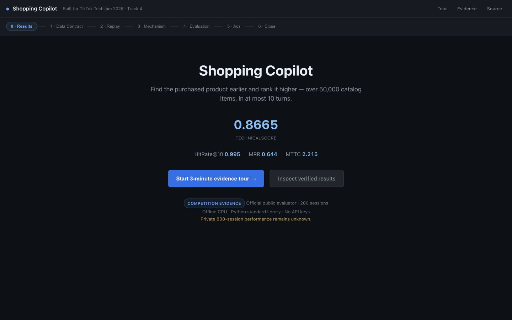
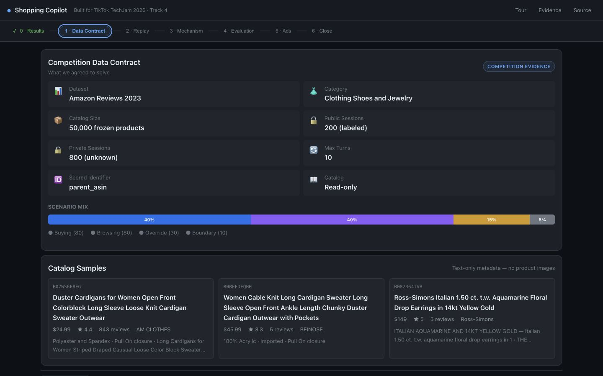
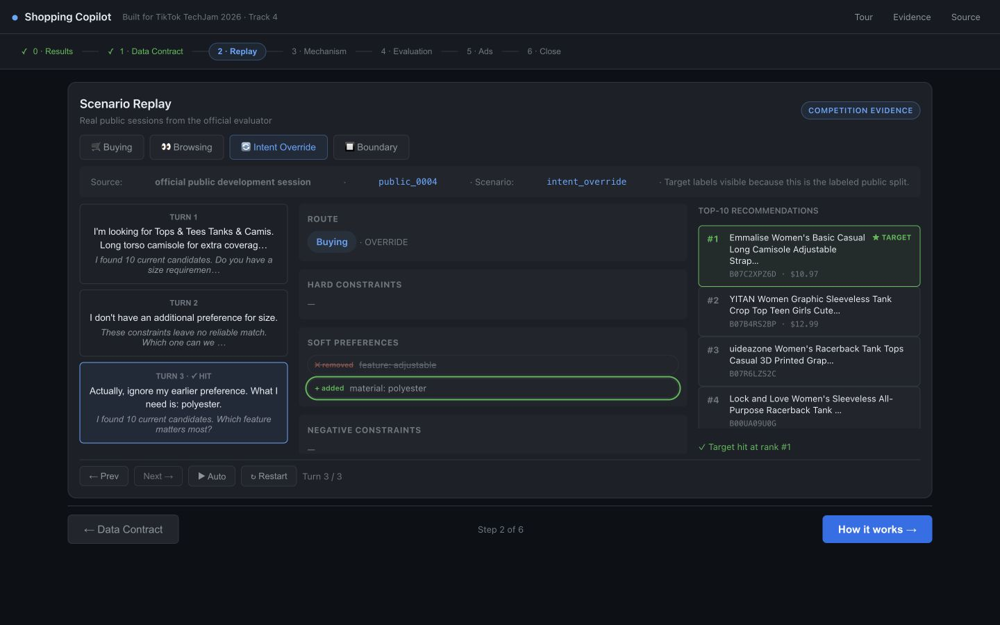
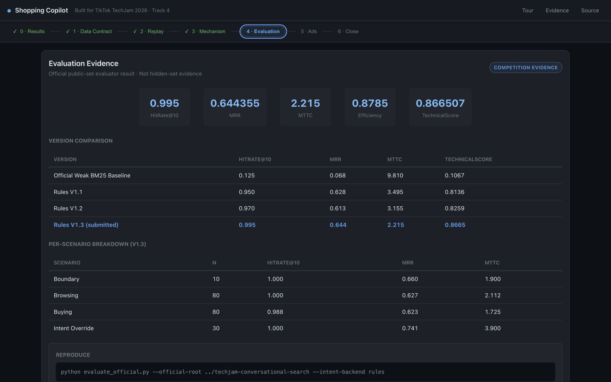
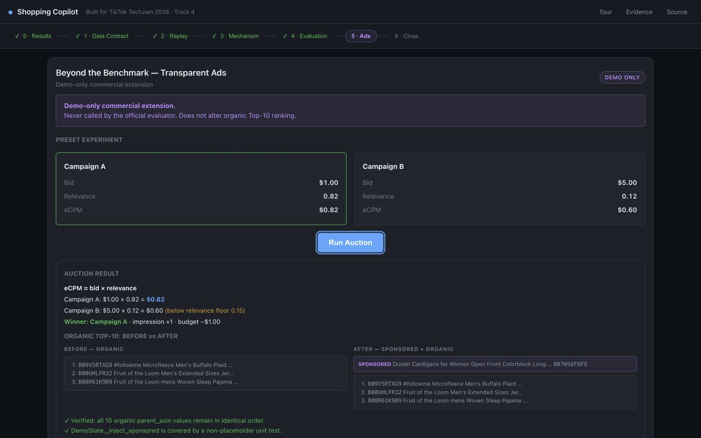
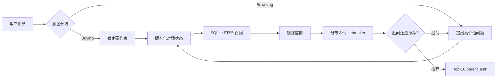
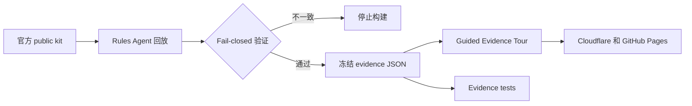

# 对话式购物 Copilot — TechJam 2026 赛题四

[English](README.md) | [简体中文](README.zh-CN.md)

一个运行在冻结的 Amazon Reviews 2023 `Clothing_Shoes_and_Jewelry` 5 万商品目录上的离线、多轮购物 Agent。

> **在线体验评委证据导览：**
> [shopping-copilot-techjam.pages.dev](https://shopping-copilot-techjam.pages.dev/)

正式打分路径只使用 Python 标准库、SQLite FTS5 和确定性规则，不需要网络、API Key、付费模型或 GPU。

<p align="center">
  <a href="https://shopping-copilot-techjam.pages.dev/">
    
  </a>
</p>

## 已验证的公开集结果

以下结果来自未修改的官方评测器和 200 个带标签的 public development sessions：

| 系统 | HitRate@10 | MRR | MTTC | Efficiency | TechnicalScore |
| --- | ---: | ---: | ---: | ---: | ---: |
| 官方弱 BM25 starter | 0.125 | 0.068034 | 9.810 | 0.1190 | 0.10671 |
| **Rules V1.3，提交路径** | **0.995** | **0.644355** | **2.215** | **0.8785** | **0.866507** |

TechnicalScore 约为 starter 的 **8.1 倍**。这些只是公开集结果，不能代表主办方保留的 800 个 private sessions。

## 实际页面

| 比赛数据合同 | Intent Override 回放 |
| --- | --- |
| [](https://shopping-copilot-techjam.pages.dev/?step=1) | [](https://shopping-copilot-techjam.pages.dev/?step=2) |
| **已验证评测结果** | **透明的 Demo-only 广告** |
| [](https://shopping-copilot-techjam.pages.dev/?step=4) | [](https://shopping-copilot-techjam.pages.dev/?step=5) |

## 项目展示的能力

- **Buying / Browsing 分流：**明确购买请求锁定约束，模糊浏览请求先做高价值追问。
- **显式对话状态：**逐轮维护硬约束、软偏好、负向约束、拒绝商品和原始检索证据。
- **Intent Override：**旧偏好会被删除并重写，而不是继续叠加。
- **轻量检索与排序：**SQLite FTS5 召回、透明规则重排和分带人气 tiebreaker。
- **候选驱动追问：**按候选覆盖度 × 信息熵选择最值得问的属性。
- **证据优先的交付网站：**公网 Tour 回放冻结的官方公开集 trace，不依赖实时 LLM。
- **演示层商业扩展：**相关性广告竞价与正式排名物理隔离，不改变自然推荐顺序。

## 快速开始

### 1. 克隆仓库

```bash
git clone https://github.com/Starryyu77/techjam-shopping-agent-v1.git
cd techjam-shopping-agent-v1
```

推荐使用 Python 3.11 或更高版本。

### 2. 运行官方公开集评测

将官方 participant kit 放在本仓库旁边，或显式指定路径：

```bash
python evaluate_official.py \
  --official-root ../techjam-conversational-search \
  --intent-backend rules \
  --output reports/official_public_rules.json
```

### 3. 本地运行

```bash
# / 是评委证据导览；/sandbox 是可选的旧版聊天沙箱
python demo/server.py --port 8000

# 完全离线的命令行交互
python chat.py --intent-backend rules
```

浏览器打开 `http://127.0.0.1:8000`。

### 4. 验证

```bash
python -m unittest discover -s tests -v
```

当前预期结果：**75 项测试全部通过**。

## Evidence 复现

仓库直接附带 200 个冻结的公开 session traces，因此干净克隆后即可运行 Tour。只有 Agent 或 evidence contract 变化时才需要重建：

```bash
python scripts/build_demo_evidence.py \
  --official-root ../techjam-conversational-search
```

遇到指标漂移、非法或重复 ASIN、trace 与报告不一致、缺少 hash、非公开案例或 canonical cases 未冻结时，构建脚本会 fail closed。

## 架构



官方评测器只调用 `submission/agent.py`。导购话术、广告位和旧版聊天 UI 都位于正式打分路径之外。

### Evidence 交付链路



## 仓库结构

| 路径 | 用途 |
| --- | --- |
| `submission/agent.py` | 官方要求的 `Agent` 接口 |
| `shopping_agent.py` | 意图、状态机、检索、排序与追问策略 |
| `evaluate_official.py` | 连接未修改官方评测器的适配器 |
| `demo/static/tour.*` | 面向评委的 Guided Evidence Tour |
| `demo/evidence/` | 公开 evidence artifacts 与 200 个 traces |
| `demo/canonical_cases.json` | 纳入版本控制的 canonical case freeze |
| `scripts/build_demo_evidence.py` | Evidence 重建与一致性验证 |
| `scripts/build_static_site.py` | 可移植静态部署构建 |
| `reports/` | 可复现实验与评测结果 |
| `reranker.py` | 默认关闭的 cross-encoder 实验 |

## 声明与数据边界

- 商品目录和官方数据集只读。
- 网站只展示官方 public split 中可见的标签与 trace。
- 主办方保留的 800-session 表现未知。
- 不把公开集分数写成 hidden-set、private-set 或最终分数。
- Qwen 与 cross-encoder 是可选实验，不是正式 rules path 的依赖。
- 广告竞价使用模拟出价和预算，官方评测器不会调用它。

## 文档导航

| 文档 | 用途 |
| --- | --- |
| [技术报告](REPORT.md) | 架构、实验、结果与限制 |
| [产品说明](PRODUCT.md) | 产品定位和演示边界 |
| [Devpost 草稿](DEVPOST.md) | 比赛提交叙事 |
| [Judge Tour 设计方案](docs/plans/2026-08-30-judge-facing-demo-design.md) | 设计与实现交接规格 |
| [Demo 操作说明](demo/WALKTHROUGH.md) | Tour 流程和证据站点 |
| [视频脚本](demo/VIDEO_SCRIPT.md) | 三分钟录制方案 |
| [提交包说明](submission/README.md) | 最小 evaluator-facing 包 |
| [开发计划](PLANS.md) | 已完成里程碑和明确暂缓事项 |
| [提示词迭代闭环](docs/loop.md) | 防泄漏的提示词验收流程 |
| [工程经验](docs/loop-lessons.md) | 失败模式与修复记录 |
| [意图提示词 v001](prompts/system_prompt_v001.md) | 可选本地模型解析契约 |

## 部署与链接

- **在线 Tour：**https://shopping-copilot-techjam.pages.dev/
- **GitHub Pages 回退：**https://starryyu77.github.io/techjam-shopping-agent-v1/
- **公开源码仓库：**https://github.com/Starryyu77/techjam-shopping-agent-v1
- **Demo 视频：**等待最终录制并上传公开 YouTube

## License 与上游数据

请遵守官方 participant kit 的数据和提交条款。本仓库不重新分发完整 Amazon Reviews 2023 上游数据；Tour 只包含为了可复现演示所需的比赛公开集 evidence。
