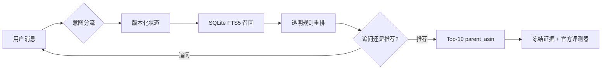
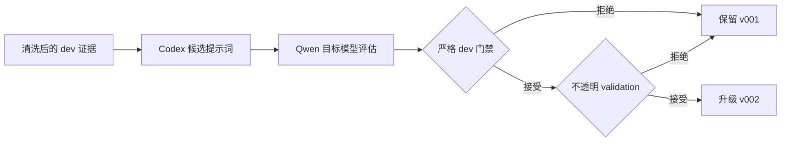
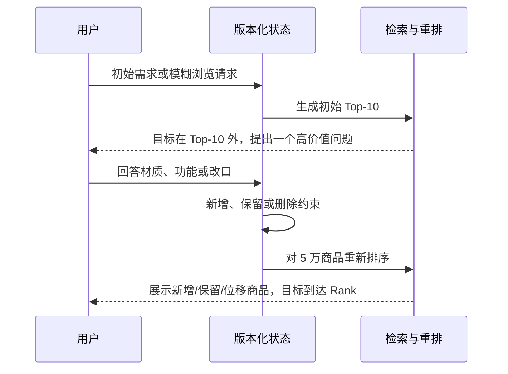
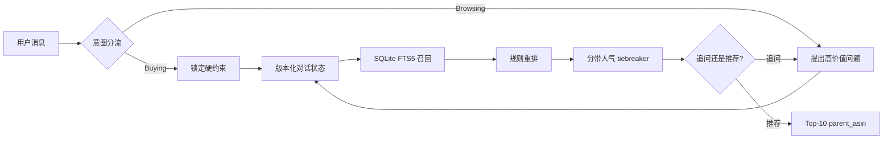
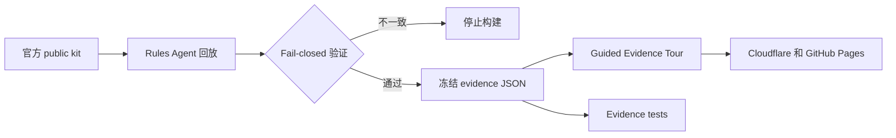

# 对话式购物 Copilot — TechJam 2026 赛题四

[English](README.md) | [简体中文](README.zh-CN.md)

一个运行在冻结的 Amazon Reviews 2023 `Clothing_Shoes_and_Jewelry` 5 万商品目录上的离线、多轮购物 Agent。

> **在线体验评委证据导览：**
> [shopping-copilot-techjam.pages.dev](https://shopping-copilot-techjam.pages.dev/)
> · [中文界面](https://shopping-copilot-techjam.pages.dev/?lang=zh)

正式打分路径只使用 Python 标准库、SQLite FTS5 和确定性规则，不需要网络、API Key、付费模型或 GPU。

<p align="center">
  <a href="https://shopping-copilot-techjam.pages.dev/">
    
  </a>
</p>

## 从这里开始

| 你的角色 | 建议入口 | 可以看到什么 |
| --- | --- | --- |
| 评委 | [三分钟证据导览](https://shopping-copilot-techjam.pages.dev/?lang=zh) | 结果 → 数据合同 → 回放 → 机制 → 评测 → 广告 → 边界 |
| 查看产品叙事 | [YouTube 演示影片](https://youtu.be/iRec-9CM9D4) | 一条公开、双语、三分钟的完整故事 |
| 复现比赛分数 | [快速开始](#快速开始) | 正式 rules-only 评测命令和预期指标 |
| 检查实现 | [每个环节如何工作](#每个环节如何工作) | 每一步的输入、决策、输出、证据和源码 |
| 使用脚本 | [脚本指南](scripts/README.md) | 稳定发布命令与研究诊断脚本的明确分层 |
| 审核声明 | [声明与数据边界](#声明与数据边界) | 公开证据、合成实验、held-out 与 private 边界 |

## 三条物理隔离的执行路径

| 路径 | 入口 | 用途 | 是否参与官方计分 |
| --- | --- | --- | --- |
| **正式提交 Agent** | `submission/agent.py` | 规则、状态、FTS5 召回、重排与 Top-10 | **是** |
| **评委证据 Tour** | `demo/static/` + `demo/evidence/` | 确定性回放冻结的官方公开集轨迹 | 否 |
| **可选开发层** | `/sandbox`、方案 B Qwen、cross-encoder、广告竞价 | 产品实验与技术透明度展示 | 否 |

这些不是文字上的声明，而是代码路径的物理隔离：官方 evaluator 不会调用网站、
广告竞价、视频或可选 Qwen 层。

## 3 分钟 V3 演示视频

[](https://youtu.be/iRec-9CM9D4)

**[在 YouTube 观看公开 3 分钟演示——英文配音 · 中英双语字幕 · 原创背景音乐](https://youtu.be/iRec-9CM9D4)**

[English subtitles](docs/assets/video/shopping-copilot-demo-v3.en.srt) ·
[中文字幕](docs/assets/video/shopping-copilot-demo-v3.zh-CN.srt) ·
[仓库 MP4 备份](docs/assets/video/shopping-copilot-demo-v3.mp4) ·
[Cloudflare 在线播放](https://shopping-copilot-techjam.pages.dev/)

## 已验证的公开集结果

以下结果来自未修改的官方评测器和 200 个带标签的 public development sessions：

| 系统 | HitRate@10 | MRR | MTTC | Efficiency | TechnicalScore |
| --- | ---: | ---: | ---: | ---: | ---: |
| 官方弱 BM25 starter | 0.125 | 0.068034 | 9.810 | 0.1190 | 0.10671 |
| **Rules V1.3，提交路径** | **0.995** | **0.644355** | **2.215** | **0.8785** | **0.866507** |

TechnicalScore 约为 starter 的 **8.1 倍**。这些只是公开集结果，不能代表主办方保留的 800 个 private sessions。

## 每个环节如何工作

| 环节 | 输入 | 系统动作 | 输出 / 证据 | 主要实现 |
| --- | --- | --- | --- | --- |
| **1. 合同** | 官方目录、会话画像、用户消息、轮次、`top_k` | 校验 evaluator 合同并保持目录只读 | 合同安全的响应字段；rules 路径 token 为 0 | `submission/agent.py`、`shopping_copilot/official_agent.py` |
| **2. 意图分流** | 最新消息 + 待回答问题 | 判断 Buying / Browsing 和 dialogue act；方案 B v002 仅为 localhost 可选层 | `domain_intent`、`dialogue_act`、置信度与规范化子句 | `RuleIntentParser`、可选 `prompts/system_prompt_v002.md` |
| **3. 版本化状态** | 解析子句 + 上一轮状态 | 新增、保留、否定、拒绝，或删除并重写被替代偏好 | 可检查的 hard / soft / negative 状态差异 | `shopping_copilot/shopping_agent.py` 中的 `ShoppingState.apply` |
| **4. 召回** | 品类、约束、检索证据、安全画像标签 | SQLite FTS5 构建广泛词法候选池，并排除拒绝/负向商品 | 最多 50 个策略候选；公开目标召回 200/200 | `CatalogSearch.search` |
| **5. 重排** | 召回候选 + 对话状态 | 奖励品类/约束精确匹配、惩罚硬约束缺失，仅在近似同分区间使用人气 | 确定性 Top-10 `parent_asin` 列表 | 规则打分器 + 分带 tiebreaker |
| **6. 追问或推荐** | 当前策略候选池 | 用覆盖度 × 信息熵选择一条真正有区分度的问题 | `ask_attribute` 或聚焦后的推荐回复 | `CandidateQuestionPolicy.choose` |
| **7. 证据交付** | 冻结的官方公开集运行产物 | 校验 ID、指标、哈希、案例冻结与 organic 顺序不变量 | 200 份 trace JSON、双语 Tour、报告、视频与静态包 | `scripts/build_demo_evidence.py`、`scripts/build_static_site.py` |



## 实际页面

| 比赛数据合同 | Intent Override 回放 |
| --- | --- |
| [](https://shopping-copilot-techjam.pages.dev/?step=1) | [](https://shopping-copilot-techjam.pages.dev/?step=2) |
| **已验证评测结果** | **透明的 Demo-only 广告** |
| [](https://shopping-copilot-techjam.pages.dev/?step=4) | [](https://shopping-copilot-techjam.pages.dev/?step=5) |

### Trace Microscope：检查真实机制

[](https://shopping-copilot-techjam.pages.dev/?step=3)

五个可点击阶段分别使用路由分叉图、状态迁移图、召回漏斗、Top-3 排名台和追问
决策链，并全部读取 Replay 当前轮次。Score anatomy 会公开正式路径中的全部排序
权重，并明确 popularity 只参与近似分数的 tie-break。

### Prompt Evolution Lab：查看已接受的方案 B 演化

[](https://shopping-copilot-techjam.pages.dev/?step=3)

在 Step 3 切换到 **Prompt Evolution Lab**，可以检查
[`codex/scheme-b-prompt-evolution`](https://github.com/Starryyu77/techjam-shopping-agent-v1/tree/codex/scheme-b-prompt-evolution)
分支中已接受的方案 B 实验。Codex 编写候选提示词，零微调 Qwen3-8B 只作为目标模型，
在 18 个合成 dev 会话 / 90 个标注轮次上评估。Composite 从 **0.6137 提升到
0.7191**（绝对 +0.1053，相对 +17.2%）；Slot F1 从 0.2727 提升到 0.5652，
rollout state exact 从 0.1000 提升到 0.2222。其余所有未饱和受保护指标均提高，
JSON compliance 保持 1.0。

候选还通过了一次 6 会话 / 30 轮的 opaque validation 门禁。Validation 只返回
接受/拒绝，随后立即终止；held-out 标签未打包也未运行。页面提供 9 组 v001/v002
合同差异和一条可播放的产物支撑升级流程，不会把它包装成实时模型输出。



我们重新计算了保存指标的公式、由 confusion matrix 推导的准确率、提示词哈希与
非退化门禁。原 localhost Qwen 服务在本次验证主机上未运行，因此结论明确标为
artifact-recomputed，而不是声称重新执行了模型推理。比赛正式分数仍严格对应
确定性的 submitted path。

## 多轮推荐与排序证据

Tour 现在展示 9 个由 owner 冻结的官方 public traces，覆盖 Buying、Browsing
和 Intent Override。每个案例都能看到用户回答、状态变化、Top-10 新增/保留/重排、
单个商品位次变化和目标商品排名轨迹。

| 场景 | Public case | 对话与推荐变化 | 结果 |
| --- | --- | --- | --- |
| Buying | `public_0018` | 目标连续两轮不在 Top-10；材质回答替换 8/10 个结果 | Turn 3 **Rank #1** |
| Buying | `public_0152` | 颜色与材质组合回答让目标手表首次进入列表 | Turn 3 **Rank #1** |
| Buying | `public_0179` | 连续三轮细化，closure 回答再次改变列表 | Turn 4 **Rank #2** |
| Browsing | `public_0049` | 六轮探索：leather → brown → rubber → casual → soft | 换入 9 个结果；Turn 6 **Rank #1** |
| Browsing | `public_0007` | 模糊需求被澄清为 polyester + spandex | Turn 3 **Rank #1** |
| Browsing | `public_0063` | 一个 stretch-feature 回答完成模糊需求澄清 | Turn 2 **Rank #1** |
| Intent Override | `public_0003` | 删除 stainless steel，继续回答，再次重排 | 换入 9 个结果；Turn 5 **Rank #1** |
| Intent Override | `public_0046` | Public preview 从 #5 到 #1；Override 删除 cotton/polyester、保留 wool | Turn 4 计分 **Rank #1** |
| Intent Override | `public_0142` | 删除三个旧值，新增 stainless steel 与 hypoallergenic | Turn 4 计分 **Rank #1** |

| Buying：回答替换 8/10 个结果 | Browsing：六轮到 Rank #1 | Override：清空旧偏好后恢复 |
| --- | --- | --- |
| [](https://shopping-copilot-techjam.pages.dev/?step=2) | [](https://shopping-copilot-techjam.pages.dev/?step=2) | [](https://shopping-copilot-techjam.pages.dev/?step=2) |

| Preview #5 → #1 → 计分 #1（`public_0046`） | 多槽位重写（`public_0142`） |
| --- | --- |
| [](https://shopping-copilot-techjam.pages.dev/?step=2) | [](https://shopping-copilot-techjam.pages.dev/?step=2) |

Replay 会严格区分 public label preview 和官方计分 hit。Override gate 尚未满足时，
即使公开标签显示目标商品已在列表中，也只标记为 `Public preview`，不会称作
`Scored target`。



## 项目展示的能力

- **Buying / Browsing 分流：**明确购买请求锁定约束，模糊浏览请求先做高价值追问。
- **显式对话状态：**逐轮维护硬约束、软偏好、负向约束、拒绝商品和原始检索证据。
- **Intent Override：**旧偏好会被删除并重写，而不是继续叠加。
- **轻量检索与排序：**SQLite FTS5 召回、透明规则重排和分带人气 tiebreaker。
- **候选驱动追问：**按候选覆盖度 × 信息熵选择最值得问的属性。
- **证据优先的交付网站：**公网 Tour 回放冻结的官方公开集 trace，不依赖实时 LLM。
- **提示词自迭代：**本地 Qwen3-8B 在受保护的 golden-case 划分上，根据混淆信号
  生成泛化改写，并经过显式 guard checks。
- **演示层商业扩展：**相关性广告竞价与正式排名物理隔离，不改变自然推荐顺序。

## 快速开始

### 1. 克隆仓库

```bash
git clone https://github.com/Starryyu77/techjam-shopping-agent-v1.git
cd techjam-shopping-agent-v1
```

推荐使用 Python 3.11 或更高版本。

### 2. 运行官方公开集评测

将官方 participant kit 放在本仓库旁边，或显式指定路径：

```bash
python tools/evaluate_official.py \
  --official-root ../techjam-conversational-search \
  --intent-backend rules \
  --output reports/official_public_rules.json
```

### 3. 本地运行

```bash
# / 是评委证据导览；/sandbox 是可选的旧版聊天沙箱
python demo/server.py --port 8000

# 完全离线的命令行交互
python tools/chat.py --intent-backend rules
```

浏览器打开 `http://127.0.0.1:8000`。

### 4. 验证

```bash
python -m unittest discover -s tests -v
```

当前预期结果：**98 项测试全部通过**。

## Evidence 复现

仓库直接附带 200 个冻结的公开 session traces，因此干净克隆后即可运行 Tour。只有 Agent 或 evidence contract 变化时才需要重建：

```bash
python scripts/build_demo_evidence.py \
  --official-root ../techjam-conversational-search
```

遇到指标漂移、非法或重复 ASIN、trace 与报告不一致、缺少 hash、非公开案例或 canonical cases 未冻结时，构建脚本会 fail closed。

## 脚本指南

[`scripts/README.md`](scripts/README.md) 是脚本的唯一索引：它区分稳定交付命令与
诊断快照，并记录每个顶层脚本的运行条件、依赖和证据边界。

| 任务 | 命令 |
| --- | --- |
| 评测完整开发仓库 | `python tools/evaluate_official.py --official-root ../techjam-conversational-search --intent-backend rules --output reports/official_public_rules.json` |
| 评测最小 `submission/` 包 | `python scripts/run_submission_eval.py --official-root ../techjam-conversational-search --output reports/submission_public_rules.json` |
| 重建全部网站证据 | `python scripts/build_demo_evidence.py --official-root ../techjam-conversational-search` |
| 构建静态部署包 | `python scripts/build_static_site.py` |
| 运行仓库合同测试 | `python -m unittest discover -s tests -v` |
| 查看命令帮助 | `python <entrypoint> --help` |

其余 `scripts/` 文件被明确标记为召回/排序诊断、参数扫描、合成压力测试或 Windows
Qwen 运维工具。它们为了实验溯源保留原位置，但不属于正常发布路径。

## 架构



官方评测器只调用 `submission/agent.py`。导购话术、广告位和旧版聊天 UI 都位于正式打分路径之外。

### Evidence 交付链路



## 仓库结构

| 路径 | 用途 |
| --- | --- |
| `submission/agent.py` | 官方要求的 `Agent` 接口 |
| `shopping_copilot/` | 可复用 Python package：状态、检索、排序、官方适配器和可选重排器 |
| `tools/` | 评测、聊天与提示词实验的用户 CLI |
| `docs/` | 产品、技术、项目、提交、Prompt 与设计文档 |
| `shopping_copilot/shopping_agent.py` | 意图、状态机、检索、排序与追问策略 |
| `tools/evaluate_official.py` | 连接未修改官方评测器的适配器 |
| `demo/static/tour.*` | 面向评委的 Guided Evidence Tour |
| `demo/evidence/` | 公开 evidence artifacts 与 200 个 traces |
| `demo/canonical_cases.json` | 纳入版本控制的 canonical case freeze |
| `scripts/build_demo_evidence.py` | Evidence 重建与一致性验证 |
| `scripts/build_static_site.py` | 可移植静态部署构建 |
| `scripts/README.md` | 脚本总索引、推荐流程、依赖与证据边界 |
| `reports/` | 可复现实验与评测结果 |
| `reports/scheme_b_prompt_evolution_verified.json` | 重新计算的方案 B 指标、门禁、哈希与声明边界 |
| `shopping_copilot/reranker.py` | 默认关闭的 cross-encoder 实验 |

## 声明与数据边界

- 商品目录和官方数据集只读。
- 网站只展示官方 public split 中可见的标签与 trace。
- 主办方保留的 800-session 表现未知。
- 不把公开集分数写成 hidden-set、private-set 或最终分数。
- Qwen prompt evolution 与 cross-encoder 是持续迭代的实验层，不是正式 rules path 的依赖。
- 广告竞价使用模拟出价和预算，官方评测器不会调用它。

## 文档导航

| 文档 | 用途 |
| --- | --- |
| [文档总索引](docs/README.md) | 产品、技术、提交、Prompt 与设计文档地图 |
| [技术报告](docs/technical/REPORT.md) | 架构、实验、结果与限制 |
| [产品说明](docs/product/PRODUCT.md) | 产品定位和演示边界 |
| [Devpost 草稿](docs/submission/DEVPOST.md) | 比赛提交叙事 |
| [Judge Tour 设计方案](docs/plans/2026-08-30-judge-facing-demo-design.md) | 设计与实现交接规格 |
| [Demo 操作说明](demo/WALKTHROUGH.md) | Tour 流程和证据站点 |
| [视频脚本](demo/VIDEO_SCRIPT.md) | 三分钟录制方案 |
| [提交包说明](submission/README.md) | 最小 evaluator-facing 包 |
| [脚本指南](scripts/README.md) | 稳定发布命令、诊断脚本、依赖与运行边界 |
| [开发计划](docs/project/PLANS.md) | 已完成里程碑和明确暂缓事项 |
| [提示词迭代闭环](docs/prompt/loop.md) | 防泄漏的提示词验收流程 |
| [工程经验](docs/prompt/loop-lessons.md) | 失败模式与修复记录 |
| [当前意图提示词 v002](prompts/system_prompt_v002.md) | 通过 dev 与一次 opaque validation 门禁的方案 B 提示词 |

## 部署与链接

- **在线 Tour：**https://shopping-copilot-techjam.pages.dev/
- **GitHub Pages 回退：**https://starryyu77.github.io/techjam-shopping-agent-v1/
- **公开源码仓库：**https://github.com/Starryyu77/techjam-shopping-agent-v1
- **公开 YouTube Demo：**https://youtu.be/iRec-9CM9D4

## License 与上游数据

请遵守官方 participant kit 的数据和提交条款。本仓库不重新分发完整 Amazon Reviews 2023 上游数据；Tour 只包含为了可复现演示所需的比赛公开集 evidence。
